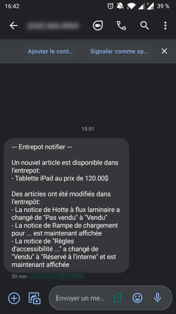

# Entrepot Notifier

This is a little side-project I got the idea from a [reportage](https://youtu.be/wIg10U8JODw) about "[l'Entrepôt](https://www.entrepot.ulaval.ca/)" of Laval University.

This idea is simple: make a notifier for new or modified articles so we don't have to check the website manually/regularly.

As it is a side-project, this was the occasion to try some tech but I absolutly wanted it to be simple and using only free stuff (This is why it is not deployed/scheduled for now).

# Tech
For the scrapping part I am using [Puppeteer](https://github.com/puppeteer/puppeteer). I could'nt use a simple GET request because the website apply some style on "notice" on each article after the page is loaded.

To remember if an article is known and detect changes, [FaunaDB](https://fauna.com/) is used.

Finally, notifications are sent through [Till Mobile](https://tillmobile.com/). Remember this is a side-project, I wanted it to be totally free and super simple (so not using/setuping Twilio for example).

# Want to run it ?

Pretty simple, first you should create your FaunaDB database with an "article" collection.
Some (obvious) indexes are also required:
- article_hash
- article_notice
- article_noticeIsHidden


Then install dependencies:
```
npm install
```

Give it some environment variables (if you are running it locally, just create a .env file on root folder):

| Variable           | Description                                                      |
| -------------------|:-----------------------------------------------------------------|
| FAUNADB_SECRET_KEY | Your FaunDB secret key for your collection                       |
| TILL_USERNAME      | Your Till Mobile username                                        |
| TILL_API_KEY       | Your Till Mobile API Key                                         |
| TILL_RECIPIENTS    | Phone number(s) you want to send notifications (comma separated) |

Build it:
```
npm run build 
```

And simply run it:
```
npm run start
```

On your first launch, you should receive a SMS (in french) because your database is empty and every article is new:

